# Mumbai Airspace Observatory Bundle

This bundle converts the raw monthly-first-day SQLite into compact, human-readable summaries for local analysis and for lightweight dashboard ingestion.

## Core Numbers
- Snapshots: **19,538**
- Aircraft points: **2,834,291**
- Unique aircraft hex codes: **9,811**
- Unique callsigns: **43,623**
- Average speed: **385.5 m/s**
- Median speed: **432.0 m/s**
- 90th percentile speed: **508.6 m/s**
- Average altitude: **26375 m**
- Average distance from BOM: **873.1 km**

## What A Resident Might Care About
- Within **50 km** of BOM, you see about **7.4** aircraft per active snapshot.
- Within **100 km** of BOM, that rises to about **12.2** aircraft per active snapshot.
- Busiest local hour in Mumbai time: **10:00**.
- Quietest local hour in Mumbai time: **04:00**.
- Busiest weekday in local time: **Sun**.
- Weekend share of visible points: **34.5%**.
- Peak local hour traffic: **161,602** points vs **75,389** at the quiet hour (2.14x).
- Peak month: **2025-02** | quiet month: **2016-07**.
- Fastest sector: **NW** | slowest sector: **N**.
- Fastest distance band: **250-500 km** | slowest distance band: **0-50 km**.
- Fastest altitude band: **12k+ m** | slowest altitude band: **0-1k m**.

## Dayparts
| Daypart | Points | Avg speed (m/s) | Avg altitude (m) |
|---|---:|---:|---:|
| Night | 464,542 | 417.7 | 29139 |
| Morning | 863,151 | 386.7 | 25939 |
| Afternoon | 754,995 | 372.5 | 25061 |
| Evening | 579,394 | 375.1 | 25249 |

## Vertical Motion
| Phase | Points | Avg speed (m/s) | Avg altitude (m) |
|---|---:|---:|---:|
| Strong descent | 515,086 | 311.4 | 15980 |
| Descent | 77,459 | 332.1 | 21396 |
| Level | 1,418,137 | 441.5 | 33149 |
| Climb | 67,022 | 408.9 | 29689 |
| Strong climb | 433,091 | 377.0 | 20745 |

## Distance Bands
| Band | Points | Avg speed (m/s) | Avg altitude (m) |
|---|---:|---:|---:|
| 0-50 km | 63,539 | 222.9 | 8541 |
| 50-100 km | 44,214 | 353.3 | 20036 |
| 100-250 km | 126,611 | 412.1 | 28143 |
| 250-500 km | 240,516 | 427.5 | 31065 |
| 500-1000 km | 966,986 | 405.9 | 28421 |
| 1000-1500 km | 1,236,575 | 368.2 | 24221 |

## Altitude Bands
| Band | Points | Avg speed (m/s) |
|---|---:|---:|
| 0-1k m | 130,699 | 30.3 |
| 1k-3k m | 71,492 | 159.2 |
| 3k-6k m | 116,667 | 196.7 |
| 6k-9k m | 110,443 | 237.9 |
| 9k-12k m | 114,343 | 278.6 |
| 12k+ m | 2,118,438 | 439.0 |

## Sector View
| Sector | Points | Avg speed (m/s) | Avg altitude (m) |
|---|---:|---:|---:|
| N | 718,563 | 342.5 | 22158 |
| NE | 482,019 | 415.8 | 28850 |
| E | 323,541 | 396.8 | 28055 |
| SE | 681,876 | 374.1 | 24307 |
| S | 134,135 | 403.4 | 26919 |
| SW | 16,294 | 407.9 | 27813 |
| W | 76,192 | 416.4 | 29762 |
| NW | 245,821 | 448.1 | 33015 |

## Yearly Trend
| Year | Points | Snapshots | Avg speed (m/s) | YoY change |
|---|---:|---:|---:|---:|
| 2016 | 0 | 0 | -- | -- |
| 2017 | 1,694 | 251 | 426.1 | -- |
| 2018 | 73,304 | 2,962 | 407.2 | 4227.3% |
| 2019 | 189,914 | 2,759 | 364.6 | 159.1% |
| 2020 | 167,395 | 2,837 | 382.1 | -11.9% |
| 2021 | 173,493 | 2,147 | 379.5 | 3.6% |
| 2022 | 335,764 | 1,803 | 395.0 | 93.5% |
| 2023 | 343,072 | 1,500 | 388.7 | 2.2% |
| 2024 | 404,150 | 1,544 | 378.2 | 17.8% |
| 2025 | 929,930 | 3,044 | 393.3 | 130.1% |
| 2026 | 215,575 | 691 | 382.7 | -76.8% |

## Slowest Zone Near Mumbai
- Slowest average speed cell: **19.0, 73.0** with **179.9 m/s** across **41,454** points.

## COVID Shift
- 2019 yearly total: **189,914** points
- 2020 yearly total: **167,395** points (-11.9% vs 2019)
- 2021 yearly total: **173,493** points (3.6% vs 2020)

## Recurrent Traffic
Aircraft below are the regular visitors that appear in multiple months of the sample.
| Hex | Months seen | Points | Avg speed (m/s) | Closest km |
|---|---:|---:|---:|---:|
| 800b80 | 87 | 3,448 | 341.5 | 1.6 |
| 800b45 | 87 | 1,537 | 345.5 | 0.5 |
| 8008c2 | 86 | 3,820 | 368.7 | 0.2 |
| 8007b2 | 86 | 3,030 | 374.7 | 0.1 |
| 800cb9 | 85 | 3,567 | 358.2 | 0.1 |
| 800b44 | 85 | 3,547 | 352.4 | 0.5 |
| 800b62 | 85 | 3,333 | 369.0 | 0.1 |
| 800be7 | 85 | 2,255 | 365.2 | 0.2 |
| 800bd4 | 84 | 3,510 | 354.6 | 0.1 |
| 800c3c | 84 | 3,473 | 356.2 | 0.3 |
| 800b12 | 84 | 3,115 | 373.9 | 0.2 |
| 800c4b | 84 | 3,031 | 373.8 | 0.2 |
| 800b13 | 84 | 2,645 | 362.8 | 4.9 |
| 800b61 | 84 | 2,628 | 363.7 | 1.1 |
| 800c64 | 83 | 3,829 | 351.8 | 0.2 |

## Inferred Airline Mix
The table below is a prefix-based guess from callsigns. It is useful for spotting patterns, not for official attribution.
| Code | Airline | Points | Callsigns | Avg speed (m/s) | Avg altitude (m) |
|---|---|---:|---:|---:|---:|
| IGO | IndiGo | 831,612 | 8,150 | 356.6 | 22924 |
| AIC | Air India | 287,114 | 1,894 | 366.7 | 23876 |
| UAE | Emirates | 92,491 | 760 | 474.5 | 33475 |
| EK | Emirates | 33,238 | 463 | 347.6 | 35081 |
| THY | Turkish Airlines | 30,117 | 449 | 468.7 | 34144 |
| OMA | Oman Air | 23,129 | 209 | 434.0 | 31416 |
| THA | Thai Airways | 19,952 | 147 | 455.7 | 32503 |
| BAW | British Airways | 10,930 | 72 | 443.0 | 30657 |
| DLH | Lufthansa | 9,855 | 62 | 446.4 | 30872 |
| AF | Air France | 9,174 | 119 | 437.4 | 32815 |
| KLM | KLM | 6,710 | 60 | 473.0 | 31332 |
| AFR | Air France | 6,613 | 78 | 450.1 | 30618 |
| AI | Air India | 6,114 | 232 | 437.9 | 31831 |
| FI | Icelandair | 4,818 | 32 | 469.8 | 35687 |
| SWR | SWISS | 4,186 | 18 | 462.8 | 30293 |

## Inferred Route Flows
Routes are based on first and last sectors in each sampled track. Direction is inferred from the change in distance to BOM.
| Route | Trips | Avg start speed | Avg end speed | Distance change (km) |
|---|---:|---:|---:|---:|
| N→N | 15,190 | 315.2 | 281.0 | 3.3 |
| SE→SE | 7,631 | 333.1 | 300.7 | 0.2 |
| NW→NW | 5,957 | 494.5 | 450.8 | 2.6 |
| SE→SE | 5,621 | 398.7 | 380.7 | -4.6 |
| N→NE | 4,452 | 393.8 | 456.7 | 28.3 |
| NE→N | 3,305 | 418.9 | 315.6 | -14.6 |
| E→E | 3,154 | 429.2 | 454.3 | 0.5 |
| S→S | 3,131 | 328.8 | 327.9 | -8.8 |
| NE→NE | 2,903 | 399.0 | 440.9 | -21.5 |
| NW→NW | 2,101 | 390.0 | 380.5 | -21.8 |
| SE→SE | 1,827 | 399.1 | 404.3 | -392.9 |
| W→W | 1,706 | 478.6 | 457.4 | 2.2 |
| SE→SE | 1,600 | 407.9 | 359.8 | 370.9 |
| N→NW | 1,459 | 384.6 | 443.5 | 141.0 |
| S→S | 1,416 | 440.2 | 444.4 | 13.6 |

## Charts
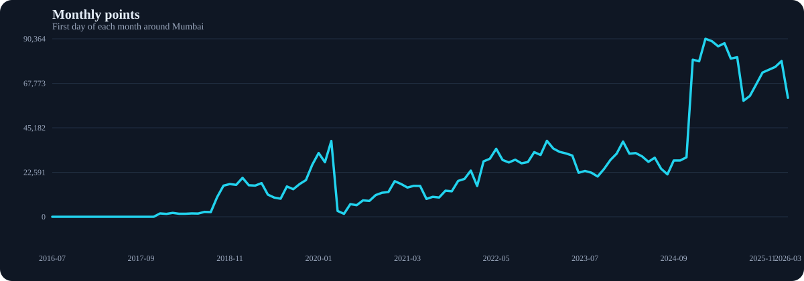
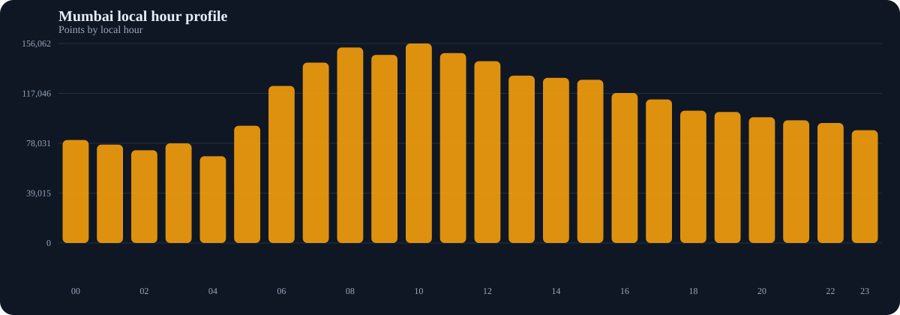
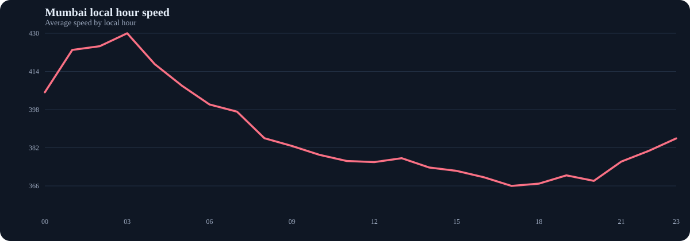
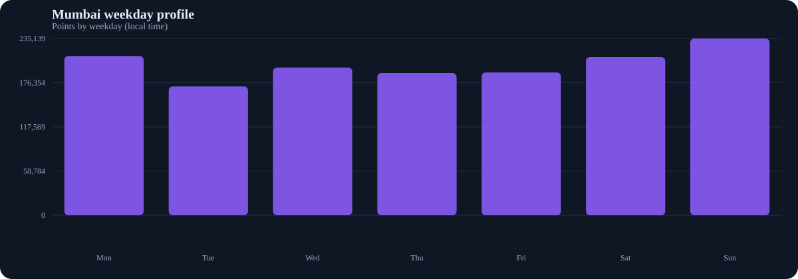
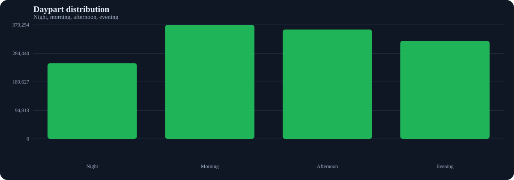
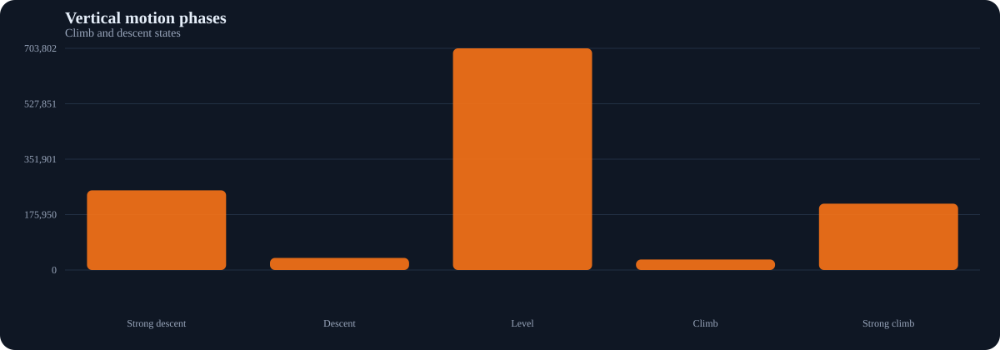
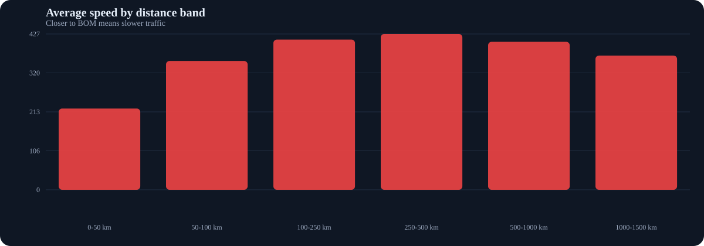
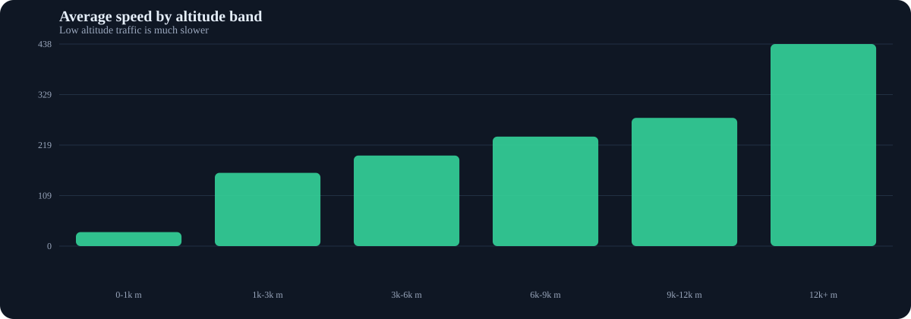
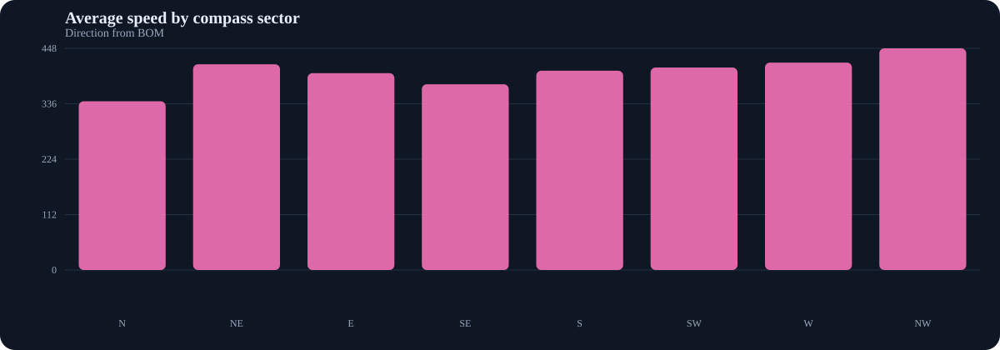
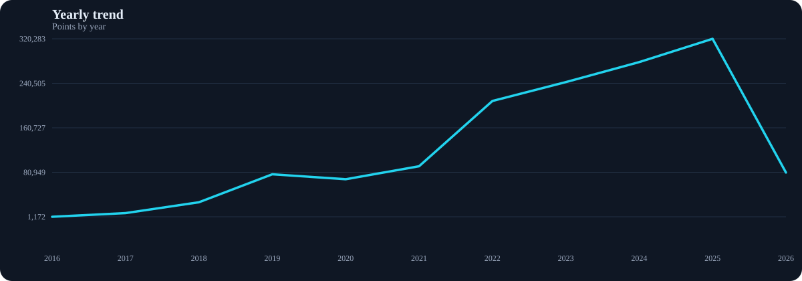
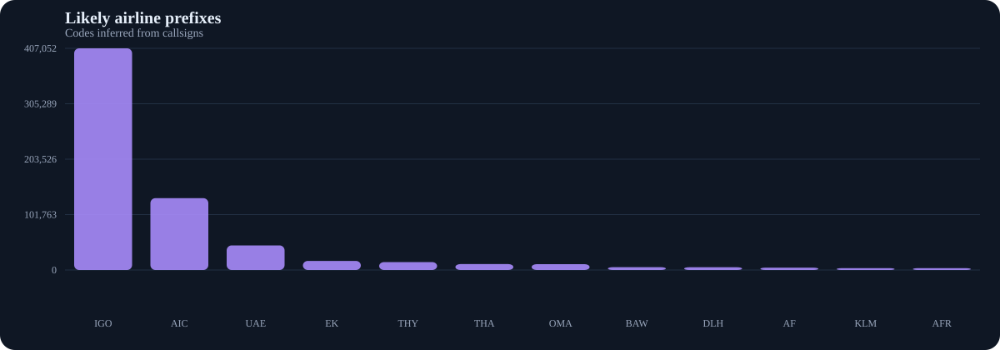
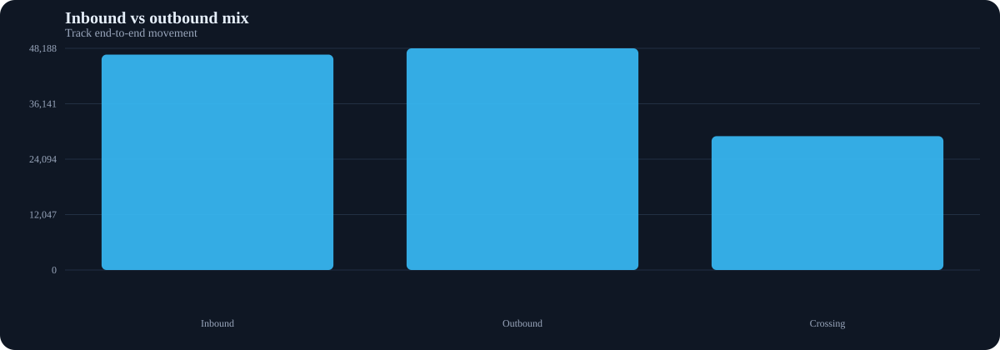
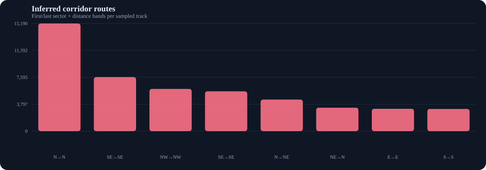
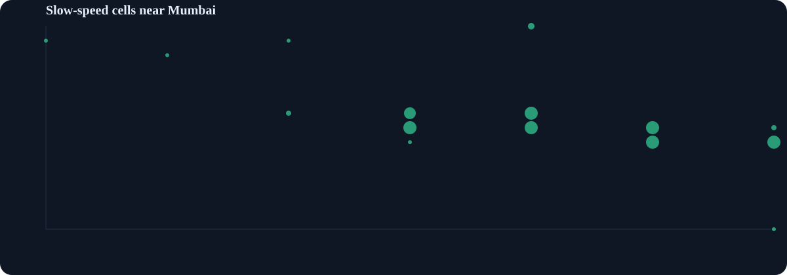